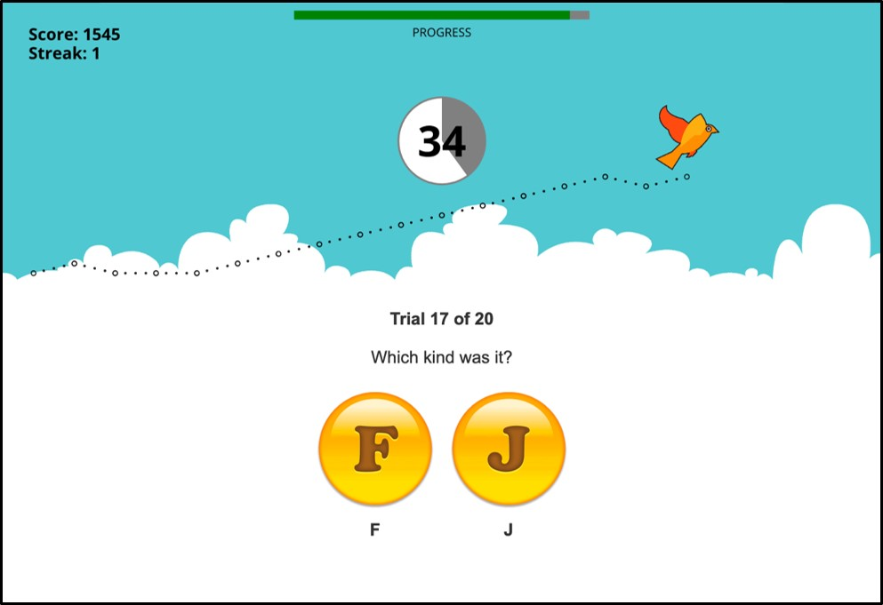

\raggedright
\LARGE

\textbf{A population-level divide in human sensitivity to musical harmony}
\vspace{0.1in}

\normalsize

\justifying
\normalsize
Sebastian Waz$^{1,2,\ast}$, Solena Mednicoff$^{1}$, Joselyn Ho$^{1}$, Courtney B. Hilton$^{4,5}$, Gregory S. Hickok$^{1,7}$, Samuel A. Mehr$^{5,6}$, & Charles Chubb$^{1,\ast}$

\footnotesize
$^{1}$Department of Cognitive Sciences, University of California at Irvine, Irvine, CA 92697-5100, USA \
$^{2}$Center for Neural Science, New York University, New York, NY 10003, USA \
$^{4}$Melbourne School of Psychological Sciences, University of Melbourne, Melbourne 3053, Australia \
$^{5}$Child Study Center, Yale University, New Haven, CT 06519, USA \
$^{6}$School of Psychology, University of Auckland, Auckland 1010, New Zealand \
$^{7}$Department of Language Science, University of California at Irvine, Irvine, CA 92697-5100, USA

\*Corresponding author. E-mails: [scw8734@nyu.edu](scw8734@nyu.edu){.email}; [cfchubb@uci.edu](cfchubb@uci.edu){.email}

\small

**Author Note.** All data and materials, including a fully reproducible version of this manuscript, are available at https://github.com/themusiclab/tone-scrambles. For assistance, contact S.W.

\bigskip
```{r setup, include=FALSE}
source("genHeatMap.R")
source("genLanguageClassFig.R")
source("genMajorMinorCategorizationHist.R")
source("genMajorMinorSameDiffHist.R")
source("genNoLessonsHist.R")
source("genWildcardHistFig.R")
source("getAllTaskDipTestTableData.R")
source("getCountryTableData.R")
source("getHistMean.R")
source("getHistOneNativeLanguage.R")
source("getNativeLanguageTableData.R")
source("getNumSubjsInHist.R")
source("getOneDipTestValue.R")
source("getOneDipTestValueYearsLessons.R")
source('getSameDiffMinus3v4AvgLowPerformers.R')
source("getSpearmanCorrHeatMapData.R")
source("getYearsSupersVsNonSupers.R")
source("getYrsTableData.R")
library(ggplot2)
```

```{=tex}
\normalsize
\begin{mdframed}[backgroundcolor=gray!20]
This study identifies a new, special class of subjects with a musically important type of auditory sensitivity.  Participants ($N =$ `r format(getNumSubjsInHist("3v4","orig"), big.mark = ",")`) in a gamified experiment listened to rapid, randomly ordered sequences of tones drawn from either a major or a minor triad and strove to classify what they heard. Performance in this major-minor tone-scramble task was strongly bimodal: a minority of ``super-listeners" performed near ceiling, while most subjects (``non-supers") performed near chance. We subsequently confirmed these results in a pre-registered direct replication ($N =$ `r format(getNumSubjsInHist("3v4","new"), big.mark = ",")`). We call the sensitivity required for high performance in this task ``MM-sensitivity". The heat map relating years-of-music-lessons to performance reveals (1) many super-listeners who never had any lessons, and (2) many non-supers whose years of lessons failed to increase their MM-sensitivity. Whether lessons increase MM-sensitivity in some listeners remains an open question.  Importantly, super-listeners tend to take many more years of lessons than non-supers, implying that super-listeners tend to achieve higher levels of musical competence than non-supers.  We argue that super-listeners may have greater sensitivity than non-supers to the qualities conferred to music by variations in scale.
\end{mdframed}
```
\bigskip

```{r rmd_config, include = FALSE}

# chunk options
knitr::opts_chunk$set(echo = FALSE, message = FALSE, warning = FALSE)

# prevent scientific notation for numerals
options(scipen = 999)

```

```{r libraries}
library(kableExtra)
library(pacman)
library(ggplot2)
p_load(
  papaja
)

```

\renewcommand{\thesection}{\arabic{section}.}
\renewcommand{\thesubsection}{\arabic{section}.\arabic{subsection}}

\section{Introduction}

In this work, we establish the existence of a special category of subjects.
For simplicity, we shall refer to the members of this group as "super-listeners".
Super-listeners reliably report greater musical achievement than subjects outside this group and they are easy to identify using a simple perceptual task.
This "tone-scramble" task does not require an understanding of music-theoretic concepts, nor does it ask subjects to make subjective assessments of a musical passage (e.g., regarding the resolution of a melody); 
it is a simple categorization task (with feedback) in which the stimulus on each trial is either a major or minor random arpeggio, with the key fixed across trials.
The difference in performance on this task is stark: super-listeners perform near perfectly, but most subjects (non-supers) do hardly any better than guessing.
That super-listeners are separated from the majority by such a sharp divide, and that this divide predicts many details of a subject's musical profile suggests that the latent cause of super-listenerhood is importantly connected to music perception and, perhaps, to musical culture more generally.  

We initially tested a sample of `r format(getNumSubjsInHist("3v4","orig"), big.mark = ",")`  subjects from around the world and found that super-listeners form a distinct category from non-supers. Then, in a preregistered direct replication across a separate sample of `r format(getNumSubjsInHist("3v4","new"), big.mark = ",")`  subjects, we confirmed that super-listeners remain a clearly distinct category.

\subsection{Normal musical abilities}
Nearly all subjects possess basic musical abilities. Two of the most important are the abilities to organize sound hierarchically based on its pitch variations and on its rhythmic variations [@Mehr2025a; @Patel2008; @Peretz1989]. In the realm of pitch, as a melody unfolds, we hear certain pitches as more stable or central and others as leading away or back toward them [@Janata1988;@Krumhansl1979;@Krumhansl1982;@Krumhansl2004;@Large2016]; in the realm of rhythm, we naturally group beats into patterns of strong and weak pulses, forming meters and nested structures [@Jones1989;@London2012;@Large2009;@Lerdahl1983]. People are also sensitive to relative pitch (recognizing a melody even when it is transposed) [@Dowling1978;@Krumhansl2001;@Shepard1964], to temporal regularity (detecting a steady beat and noticing deviations from it) [@Grahn2007;@Iversen2008], and to patterns of tension and release over time [@Huron2006;@Koelsch2014;@Krumhansl1996;@Lerdahl2005;@Meyer1962]. Even infants demonstrate many of these abilities [@Bianco2026;@Hannon2005;@Trehub2006;@Winkler2009], suggesting they are deeply rooted in human biology. Together, these basic skills allow all subjects (other than those who suffer from specific musical deficits), across different cultures, to make sense of music without any training [@Mehr2019].

Although super-listeners and non-supers alike possess these basic musical capabilities, the fact that super-listeners achieve substantially higher levels of musical competence than non-supers suggests that super-listeners possess some musically important capability that non-supers lack.  A basic question motivating the current study is: what is the nature of this capability?

\subsection{Past tone-scramble studies}

Although previous experiments have shown that the tone-scramble task yields bimodally distributed performance, the current experiment shines a much brighter light on this phenomenon by sampling vastly more subjects from a much broader range of backgrounds than any previous study.  

On average, subjects hear music in the major scale as sounding “happy” and music in the minor scale as sounding “sad” [e.g., @DallaBella2001; @Bonetti2019; @Cunningham1988; @Gerardi1995; @Gagnon2003; @Heinlein1928; @Hevner1935; @Kastner1990; @Peretz1998; @Temperley2013].  However, the emotional character of a piece of music also depends on other features (e.g., tempo, rhythm, timbre, harmony and dynamics).  Other evidence suggests, however, that these associations may not be shared across all cultures [@Athanasopoulos2021,@Smit2022].

@Chubb2013c introduced tone-scrambles in order to isolate the effects of scale from other aspects of musical structure. These stimuli are randomly ordered sequences of pure tones, all of the same duration and loudness.  On each trial, the notes in the tone-scrambles used by @Chubb2013c were drawn either from a $G$-major or a $G$-minor triad, and the task was to guess (with feedback) which type was presented.  This experiment revealed dramatic individual differences. Roughly one-third of subjects (super-listeners) performed near ceiling; the rest (non-supers) performed near chance. Subsequent experiments yielded similar results, showing repeatedly that performance in this task is bimodally distributed [@Dean2017; @Mednicoff2018; @Ho2020; @Ho2022].

These experiments have also shown that musical training is positively correlated with performance in the tone-scramble task.  This correlation is driven primarily by a large group of subjects with little or no training who perform near chance in the tone-scramble task and a smaller group of subjects with many years of training who perform near ceiling.  However, these experiments have also revealed a moderate number of subjects with many years of music lessons who perform near chance in the tone-scramble task as well as a moderate number who have never taken lessons who perform near ceiling. We anticipate that the large sample size in the current study will clarify the relationship between years of music lessons and super-listenerhood.

\subsection{Do non-supers suffer from a labeling problem?}

Consider the task of identifying notes presented individually. For all subjects except those with perfect pitch, this task is very difficult.  Nonetheless, nearly all subjects can discern whether two notes presented in succession are different.  Perhaps the situation is similar for non-supers in the tone-scramble task.  Under this story, non-supers find it difficult to identify major vs minor tone-scrambles when they are presented individually, but if the two types of stimuli are presented in succession, non-supers can discern that they differ in quality.

To investigate whether non-supers experience a labeling challenge of this sort, the current study tests each subject in a novel same-different task. On each trial in this task, the subject hears two tone-scrambles separated by a brief interval. The tone-scrambles are either the same type (both minor or both major) or different types (one minor and one major). If non-supers can hear that the two types are different (even though they are unable to classify individual tone-scrambles as major or minor), then we should find that they perform significantly better in the same-different task than in the basic tone-scramble task.  

\subsection{Does super-listenerhood depend on early-life language exposure?}

One goal of the current study was to determine whether native speakers of tonal languages (i.e., languages that assign different meanings to words with identical syllables but different pitch contours [@pike1948tone; @van2010survey]) perform better on tone-scramble tasks than native speakers of non-tonal languages.  That this might be the case is suggested by a number of previous results. For example, the prevalence of perfect pitch is higher among native speakers of tonal vs non-tonal languages [@Deutsch2004;@Deutsch2006], and native speakers of tonal languages perform better than native speakers of non-tonal languages in relative pitch tasks [@hove2010ethnicity] and melodic discrimination tasks [@LiuHilton2023].  We will use the responses to a self-report item that asks for native language to gain insight into whether super-listenerhood depends on early-life, language exposure.

# \label{sec:TMLExp2}Methods

## \label{sec:TMLParticipants2}Participants

Participants were visitors to the citizen-science website \url{https://themusiclab.org} who followed a link to the "Are You a Super-Listener?" game. They discovered the website and game by word-of-mouth (e.g., through postings on Reddit) and, as in many gamified experiments (see @Long2023), were provided with a visualization of their performance rather than being compensated for their participation. All participants gave informed consent under an ethics protocol approved by the Yale University Human Research Protection Program (protocol 2000033433).

We first analyzed data from `r format(getNumSubjsInHist("3v4","orig"), big.mark = ",")` people who participated between February 22, 2021, and April 4, 2022. These data were drawn from an initial sample of 149,169 website visitors, from which we excluded participants in the same fashion as prior studies run on the same website [@LiuHilton2023]; see SI Text \ref{Supp:Participants} for a list of exclusion criteria. 

As found in previous laboratory studies, performance in the tone-scramble task was bimodally distributed.  We then preregistered our initial analyses and results, and proceeded to analyze data collected after April 4, 2022, until February 14, 2025. These data represented `r format(getNumSubjsInHist("3v4","new"), big.mark = ",")` additional participants, excluding some visitors to the website based on the same criteria as above. Altogether, the present sample size is `r format(getNumSubjsInHist("3v4","all"), big.mark = ",")`.

## The "Are You a Super-Listener?" game.

The game consisted of three tone-scramble tasks: the major-minor categorization task, the major-minor same-different task, and the wildcard categorization task. The order of the major-minor categorization and same-different tasks was randomly determined for each subject.  The wildcard categorization task came last.

At the start of each task, the subject viewed text instructions and performed a brief training sequence consisting of four labeled examples and four practice trials.  The subject could repeat this sequence as many times as desired.

### Tone-scramble construction
In all tasks, a tone-scramble comprised 12 consecutive "pips", each pip being a 65-ms pure tone windowed by a raised cosine function with 22.5 ms rise and decay times; each tone-scramble lasted 780 ms. All pips had equal amplitude, and volume was adjusted manually by each subject to a comfortable level prior to the experiment. The notes in a given tone-scramble were always presented in a random order. The stimuli were generated at trial time and played using the Web Audio API [@WebAudio2021].

The notes of the pips in any given stimulus were all drawn from the equal-tempered chromatic scale from $G_5$ to $G_6$.  Every tone-scramble in any of the 9 different tasks included three copies of each of the notes, $G_5$, $D_6$, and $G_6$. This ensured that a tonic of $G$ was well-established on every trial in every task.  Any given tone-scramble also included 3 pips of an additional "target" note.  For example, major tone-scrambles in each of the major-minor categorization same-different tasks included 3 pips of note $B\natural_5$, whereas minor tone-scrambles included pips of note $B\flat_5$.

### The major-minor categorization (MMC) task
The major-minor categorization (MMC) task was a modified version of the tone-scramble task used by  @Chubb2013c.  In this task, a single tone-scramble was presented on each trial; the participant indicated which type they heard and received immediate feedback. This task comprised 20 trials including 10 major and 10 minor tone-scrambles presented in random order.

### The major-minor same-different (MMSD) task

In the major-minor same-different (MMSD) task, the stimulus comprised two tone-scrambles separated by a 300 ms gap.  The notes in the two tone-scrambles were presented in different, random orders.  In a "same"-stimulus, the two tone-scrambles were either both minor or both major; in a "different"-stimulus, one tone-scramble was major and the other was minor. 
The participant indicated whether the two stimuli were the same type or different types by pressing a key on the keyboard or tapping an icon (see Sec. \ref{sec:user_interface}) and received immediate feedback.

The MMSD task comprised 16 trials presented in random order, including four "same"-stimuli with both tone-scrambles minor, four "same"-stimuli with both tone-scrambles major, four "different"-stimuli with the first tone-scramble minor, and four "different"-stimuli with the first tone-scramble major.  

### The wildcard categorization task
In the wildcard task, the subject was randomly assigned to one of 7 task conditions: the 1v2- 2v3-, 4v5-, 5v6-, 8v9-, 9v10- or the 10v11-task.
Each of these tasks was analogous to the MMC task, except using different target notes.  We code the notes of the (equal-tempered) chromatic scale between $G_5$ and $G_6$ as follows: $A\flat_5\rightarrow 1$, $A_5\rightarrow 2$, $B\flat_5\rightarrow 3$, $B_5\rightarrow 4$, $C_6\rightarrow 5$, $C\sharp_6\rightarrow 6$, $D_6\rightarrow 7$, $E\flat_6\rightarrow 8$, $E_6\rightarrow 9$, $F_6\rightarrow 10$, $F\sharp_6\rightarrow 11$.  The two target notes in a given wildcard task are the two notes whose codes appear in the name of the task. For example, the two target notes in the 1v2-task are the notes 1 ($A\flat_5$) and 2 ($A_5$); and the two target notes in the 8v9-task are the notes 8 ($E\flat_6$) and 9 ($E_6$). Along with the MMC task (which would be the ``3v4-task" in the notation used for the wildcard tasks), the wildcard tasks comprise all possible categorization tasks in which (1) the two target notes differ by a semitone and (2) neither of the target notes is $G_5$, $D_6$ or $G_6$.

## Self-report items
Before and after completing the three tasks, participants completed self-report items concerning demographics, musical training experience, and their current and past engagement with musical activities (see SI Text B for a full list of items). 

## User interface \label{sec:user_interface}
The user-interface of the behavioral experiment appeared in the lower half of the screen while visual elements of a corresponding video game updated with the participant's progress in the upper half of the screen (Fig. \ref{Fig:game_hud}).
Subjects playing with a keyboard and/or mouse used the "F" and "J" keys to label each stimulus as Type-1 and Type-2, with clickable images shown on screen to match.  Subjects with touch-screen devices instead used on-screen buttons labeled "1" and "2".  The mapping of keys (or on-screen buttons) to the Type-1 and Type-2 stimuli was randomized for each subject on each task.
During the MMSD task, images used to represent the keys/buttons were replaced by images bearing the symbols "$=$" and "$\neq$", matching the randomized mapping.
Feedback was provided as the message "CORRECT" or "INCORRECT" appearing immediately after each response in the lower half of the screen with corresponding video-game animations in the upper half.
The feedback remained on-screen for 700 ms.
This was followed by a 150 ms post-trial gap after which the stimulus of the next trial began to play automatically.

During the game, a bird avatar moved along an invisible grid, with the avatar's horizontal and vertical position corresponding, respectively, to the player's progress through the task and cumulative performance.  The display provided subjects with their current streak (i.e., current number of consecutive correct responses, reset to 0 at the start of each task) and number of points, a value updated cumulatively over all three tasks based on correctness and response time.  The points system was intended to motivate subjects to complete the game quickly but only insofar as their ability would allow.  The reward in points for a correct response was equal to the punishment in points for an incorrect response of similar response time.  See Appendix \ref{Supp:Bird} for details about how points were awarded.

Upon completion, the participant was presented with a visualization of their score and told whether they had achieved "super-listener" status.

# Results

## Performance in the major-minor categorization task

The histogram of \%-correct in the MMC is shown in Fig. \ref{fig:MajorMinorCategorizationResults}. 
In line with previous findings, the histogram of \%-correct in the MMC task is strongly bimodal:
as Table \ref{table:dipTestsAllTasks} shows, the null hypothesis that \%-correct is unimodally distributed in the MMC task is rejected with $p<0.0001$ by Hartigan's dip test [@Hartigan1985].  Also shown in Table \ref{table:dipTestsAllTasks} (as well as in Tables \ref{tbl:countries}, \ref{tbl:nativeLanguages}, and \ref{table:dipTestsLessons}) are $N$, the number of subjects contributing to the histogram; \emph{85\%-or-more}, the proportion who responded correctly on at least 85\% of the trials; and \emph{dip}, the statistic computed in Hartigan's dip test.
\footnote{A basic assumption of Hartigan's dip test is that the cumulative distribution function generating the data is continuous. This is not true for our data; the number of correct responses for any given subject
was always one of the values $0,1,2,\cdots,20$.  To make the data amenable to Hartigan's dip test, we added an independent random variable uniformly distributed on $(0,1)$ to the number correct achieved by a given subject.  This insures that the cumulative distribution function underlying the data is continuous on the interval (0,21) (or (0,17) in the case of the MMSD task).  We then compare the dip-value extracted from the data with 10,000 dip-values extracted from a uniform distribution with the number of samples equal to the number of subjects contributing to the data.  The $p$-value reported gives the proportion of those 10,000 dip-values greater than the dip-value extracted from the data. If the data histogram is strongly bimodal this proportion will be close to 0; if the data histogram is strongly unimodal, this proportion will be close to 1.}
85\%-or-more provides a rough measure of the proportion of super-listeners contributing to the histogram, and Hartigan's dip statistic reflects the relative strength of the deviation from unimodality.  Thus, for example, two histograms which both have dip-test-p $<0.0001$ may differ in the strength of their deviation from unimodality; this difference will be reflected by the difference between their dip statistics.


```{r, fig.width=10, fig.height=7, warning=FALSE, eval=TRUE, message=FALSE, tidy=TRUE, dev='png', echo=FALSE, fig.cap="\\label{fig:MajorMinorCategorizationResults} Histogram of percent correct in the major-minor categorization (MMC) task across all subjects.", out.width = '60%', fig.align='center'}
genMajorMinorCategorizationHist()
```

If we identify a subject's \emph{skill} in the MMC task as the expectation of their \%-correct, then we face the following question: across our sample of subjects, what is the distribution of skills?  A detailed answer to this question is beyond the scope of this paper; however, several observations about the relationship between this underlying distribution of skills and the observed distribution of \%-correct may be useful.  First, it is unlikely that the actual skill of any subject is below 50\%; more plausibly, the many subjects who achieved scores below 50\% were non-supers who happened by chance to score lower than their skills in the 20 trials of the MMC task.  Of course, it is also possible for non-supers to get lucky and score higher than their skills. On the other hand, a super-listener with ability equal to 100\% is guaranteed to score 100\%.  As this observation suggests, super-listeners are unlikely to contribute to the lower mode (at 55\%) of the histogram in Fig. \ref{fig:MajorMinorCategorizationResults}; however, it is likely that some non-supers contribute to the higher mode (at 100\%).  More generally, we can think of the histogram in Fig. \ref{fig:MajorMinorCategorizationResults} as a transformation that blurs the underlying distribution of skills strongly near 50\% and preserves it more accurately for skills near 100\%.

As these reflections suggest, the underlying distribution of skills probably has two cusps, a large one (due to non-supers) that decreases sharply from 50\% and another smaller one (due to super-listeners) that increases sharply to 100\%.  Although our emphasis in the current study is on the subjects whose skills are concentrated in these two cusps, there also probably exists a low concentration of subjects whose skills fall along the continuum between these two cusps.

## The bimodality persists across participants of different backgrounds

Table \ref{tbl:countries} shows the statistics for histograms of \%-correct in the MMC task from the 20 most common countries in our data set.  For more than half of these conuntries dip-test-$p < 0.0001$, and in all but 3 cases, the dip-test-$p$ is less than 0.02.  Thus, performance in the MMC task tends to be bimodally distributed across most countries.  The histograms for Brazil, India and Turkey all yielded dip-test-$p>0.5$ indicating that they were closer to unimodal than to bimodal.  Not surprisingly, these are also the three countries with the lowest proportions of subjects who scored 85\%-or-more, suggesting that the samples from these countries comprised unusually low proportions of super-listeners.

Table \ref{tbl:nativeLanguages} shows analogous results for the 20 most common native languages in our data set. In 13 cases, $p < 0.0001$. For all but 3 native languanges (Turkish, Hindi and Tagalog), the histogram was closer to bimodal than unimodal. Typically, high $p$-values in Hartigan's dip test result because the high-performance mode is too small. The reverse is true for the sample of native Korean speakers: the proportion of native Korean speakers who scored 85\% or more correct was unusually high: `r h=getHistOneNativeLanguage('Korean'); sprintf('%0.4f',sum(h[18:21]))`.  By contrast, for example, the proportion of native Hindi speakers who scored 85\% or more correct was `r h=getHistOneNativeLanguage('Hindi'); sprintf('%0.4f',sum(h[18:21]))`. It would be a mistake, however, to ascribe much significance to these variations. The word-of-mouth process that generates the sample of native speakers of a given language may well spread through a subgroup all of whom tend to have the same level of musical competence; by chance, this may be high for some languages and low for others.

```{r} 
df <- getCountryTableData()
library(kableExtra)

knitr::kable(
  df,
  format = "latex",
  booktabs = FALSE,     # IMPORTANT: we want classic rules, not booktabs
  align = "lcc",      # vertical lines between columns
  caption = "Histogram statistics for the MMC task across the 20 countries with the most subjects\\label{tbl:countries}"
)
```

Fig. \ref{fig:LanguageClassResults} shows the histograms of \%-correct in the MMC task for native speakers of tonal, pitch-accented and other languages.  There are slight differences between the histograms for these different classes.  In particular, as shown in the figure, proportion of subjects with 85\%-or-more correct is 0.2950 for native speakers of tonal languages, 0.2813 for native speakers of pitch-accented languages and 0.2580 for native speakers of languages that fall in neither of these categories.  It is possible that these differences reflect systematic differences in sensitivity to tone-scrambles conferred by early linguistic experience.  However, it also possible that these differences are due to the vagaries of our sampling methods.  Importantly, each of these three classes of language comprises a large subgroup of non-supers, implying that early language exposure exerts little, if any, influence on super-listenerhood.

```{r nativeLanguageTbl} 
df <- getNativeLanguageTableData()
df[,4]=round(10000*df[,4])/10000
df[,3]=round(10000*df[,3])/10000
library(kableExtra)

knitr::kable(
  df,
  format = "latex",
  booktabs = FALSE,     # IMPORTANT: we want classic rules, not booktabs
  align = "lcc",      # vertical lines between columns
  caption = "Histogram statistics for the MMC task across the 20 native languages with the most subjsects\\label{tbl:nativeLanguages}"
)
```


```{r, fig.width=10, fig.height=7, warning=FALSE, eval=TRUE, message=FALSE, tidy=TRUE, dev='png', echo=FALSE, fig.cap="\\label{fig:LanguageClassResults} Histograms of \\%-correct in the MMC task for subjects with different classes of native languages.", out.width = '80%', fig.align='center'}
genLanguageClassFig()
```

```{r}
df <- getAllTaskDipTestTableData()

library(kableExtra)

knitr::kable(
  df,
  format = "latex",
  row.names = FALSE,
  booktabs = FALSE,     # IMPORTANT: we want classic rules, not booktabs
  align = "lccc",      # vertical lines between columns
  caption = "\\label{table:dipTestsAllTasks}Histogram statistics for all tasks"
)
```

## \label{sec:musicalTrainingAndScore} The association between musical training and MMC-task \%-correct
``` {r,  fig.width=6, fig.height=6, warning=FALSE, eval=TRUE, message=FALSE, tidy=TRUE, dev='png', echo=FALSE,fig.cap="\\label{fig:musicTrainingScores} A heat map representing the joint distribution of subjects' scores on the MMC task and their years of musical training. The numbers (and color) within each cell represent the number of subjects who achieved the corresponding score and reported the corresponding years of training. Note that the bins along the x-axis correspond to the fixed responses available to participants: ``Less than a year'', ``1-2 years'', ``2-4 years'', ``4-6 years'', ``6-10 years'', and ``More than 10 years''.", out.width = '70%', fig.align='center'}
genHeatMap()
```

```{r, fig.width=6, fig.height=4, warning=FALSE, eval=TRUE, message=FALSE, tidy=TRUE, dev='png', echo=FALSE, fig.cap="\\label{Fig:noLessonsMajorMinorHist} Histogram of percent correct in the MMC  task achieved by subjects who reported never having taken music lessons.", out.width = '50%', fig.align='center'}
genNoLessonsHist()
```

As observed in previous lab experiments, the current results show that years-of-music-lessons is positively correlated with \%-correct in the MMC  task across the `r outCounts <- read.csv("../analysis/heatMapCounts.csv"); format(sum(outCounts), big.mark = ",")` subjects who provided this information (Fig. \ref{fig:musicTrainingScores}). It is very clear, however, that this correlation is due to two separate clusters of subjects: a cluster of non-supers whose mode is at 1-2 years-of-music-lessons and 55\% correct, and a separate cluster of super-listeners whose mode is at $>10$ years-of-music-lessons and 100\% correct. A linear correlation coefficient is therefore not an appropriate measure of the strength of this association. Instead, we use the Spearman rank correlation $\rho$, which measures how well MMC task-score can be approximated by an arbitrary monotonic function of years-of-music-lessons. We find $\rho=$ `r sprintf("%0.4f",getSpearmanCorrHeatMapData())` ($p$ infinitesimal).  We also note that (1) each of the two clusters of subjects is broadly elongated across years-of-music-lessons, and (2) a bimodal distribution in \%-correct persists across all levels of musical training (see Table \ref{table:dipTestsLessons}).  

```{r} 
df <- getYrsTableData()
library(kableExtra)

knitr::kable(
  df,
  format = "latex",
  row.names = FALSE,
  booktabs = FALSE,     # IMPORTANT: we want classic rules, not booktabs
  align = "lc",      # vertical lines between columns
  caption = "\\label{table:dipTestsLessons}Histogram statistics for the MMC task across groups with different amounts of music lessons"
)
```

As shown in Fig. \ref{Fig:noLessonsMajorMinorHist}, the distribution of \%-correct in the MMC  task is also bimodally distributed across the subset of subjects who reported never having taken music lessons.  Although this distribution has a large mass of subjects who perform near chance, roughly 6\% of these subjects achieve 90\% or more.  That this distribution is not unimodal is confirmed by Hartigan's dip test ($p=$ `r getOneDipTestValueYearsLessons("noLessons")`).

## Performance in the wildcard tasks

```{r, fig.width=10, fig.height=7, warning=FALSE, eval=TRUE, message=FALSE, tidy=TRUE, dev='png', echo=FALSE, fig.cap="\\label{fig:OtherToneScrambleTaskResults} Histograms of \\%-correct in the wildcard tone-scramble tasks.", out.width = '80%', fig.align='center'}
genWildcardHistFig()
```

Figure \ref{fig:OtherToneScrambleTaskResults} shows the histograms of \%-correct in the wildcard tasks.  Performance tends to be worse in these tasks than in the MMC task.
Also, the histograms in Fig. \ref{fig:OtherToneScrambleTaskResults} seem to be less strongly bimodal than that of the MMC task.  This impression is confirmed by Hartigan's dip test (Table \ref{table:dipTestsAllTasks}).  The only wildcard task to yield a strongly bimodal distribution of \%-correct was the 8v9-task.  This is striking because the target notes in the 8v9-task are $E\flat_5$ (degree 6 of the $G$ natural and harmonic minor scales, as well as of the descending $G$ melodic minor scale) and $E\natural_5$ (degree 6 of the $G$-major scale).  After degree 3, degree 6 is generally held to be the next most important in determining the majorness vs minorness of the scale.

## Performance in the major-minor same-different (MMSD) task

We were initially surprised by the results from the MMSD task.  In striking contrast to the MMC task, the histogram of performance in the MMSD task (Fig. \ref{fig:MajorMinorSameDiffResults}) is strongly unimodal (Hartigan's dip test yields $p =$ `r getOneDipTestValue(1)`).  This is due, at least in part, to the fact that many of the subjects who performed perfectly in the MMC task failed to do so in the MMSD task: around 11\% of subjects perform at ceiling in the MMC task, but only around 4\% perform at ceiling in the MMSD task. 

Why should super-listeners performed worse in the MMSD task than in the MMC task?  We suspect that the MMSD task is challenging for super-listeners because the mapping from stimuli to responses is more complicated in the MMSD task than it is in the MMC task.  For a super-listener, major and minor tone-scrambles evoke clearly distinct perceptual qualities. The MMC task requires the subject to map those qualities directly onto the appropriate responses.  By contrast, the MMSD task requires a more complicated operation: the subject must encode and retain the qualities evoked by the first and second tone-scrambles and then compare them to produce a response.  If $T_1$ and $T_2$ are the two memory traces to be compared, then the subject should respond "same" if $T_1=\mathrm{major}$ and $T_2=\mathrm{major}$ or if $T_1=\mathrm{minor}$ and $T_2=\mathrm{minor}$; conversely, the subject should respond "different" if $T_1=\mathrm{major}$ and $T_2=\mathrm{minor}$ or if $T_1=\mathrm{minor}$ is major and $T_2=\mathrm{major}$.  We suspect that the added complexity of these requirements coupled with the limited opportunity to practice the task and the small number of trials in the task itself increased the number mistakes made by super-listeners in the MMSD task.

### On average, performance was worse in the MMSD task than in the MMC task
In the complete sample, the mean \%-correct in the MMC task was `r sprintf('%0.2f',100*getHistMean("3v4"))`\%, whereas the mean \%-correct in  the MMSD task was only  `r sprintf('%0.2f',100*getHistMean("samediff"))`\%. 
Although this difference seems small, it is highly significant.  One might be tempted to conclude from this that non-supers in the MMC task do not improve in the MMSD task.
However, interpreting the data is complicated by the difference between the histograms of the MMSD and MMC tasks.

### Non-supers improve, but only very slightly, in the MMSD task
The drop in performance of the super-listeners in the MMSD task raises the possibility that non-supers may actually perform better in the MMSD task than they do in the MMC task but that average performance in the MMSD task is dragged down because of the poorer performance by super-listeners. 

The following analysis shows that this is true.  Across all subjects who scored from 25\% to 75\% correct, the average difference in \%-correct between the MMSD and MMC tasks was `r x = getSameDiffMinus3v4AvgLowPerformers(); sprintf('%0.3f',x$estimate)`\%. Although this difference is statistically significant (with degrees of freedom `r x = getSameDiffMinus3v4AvgLowPerformers(); format(x$parameter, big.mark = ",")`, $t =$ `r x = getSameDiffMinus3v4AvgLowPerformers(); sprintf('%0.3f',x$statistic)`, $p$ infinitesimal), it is negligible:  if one of these non-supers were tested in `r x = getSameDiffMinus3v4AvgLowPerformers(); sprintf('%0.0f',100/x$estimate)` trials in each of the MMSD and MMC tasks, this subject would be expected to respond correctly on only one trial more in the MMSD task than in the MMC task.

```{r, fig.width=10, fig.height=7, warning=FALSE, eval=TRUE, message=FALSE, tidy=TRUE, dev='png', echo=FALSE, fig.cap="\\label{fig:MajorMinorSameDiffResults} Histogram of percent correct in the MMSD task across all subjects.", out.width = '60%', fig.align='center'}
genMajorMinorSameDiffHist()
```

We conclude that whatever labeling problem non-supers may experience is not an important source of their difficulty in performing the MMC task.  It follows that non-supers discern little, if any, difference in quality between major vs minor tone-scrambles.

# Discussion

Super-listeners evidently possess some type of auditory sensitivity that non-supers lack.  We will refer to this as "MM-sensitivity".  What can we say about the nature of MM-sensitivity?

``` {r get mean years-lessons for supers and non-supers}
dfYears <- getYearsSupersVsNonSupers()
```

To address this question, we focus first on Fig. \ref{fig:musicTrainingScores}, which makes several things clear.  First, for many non-supers, music lessons do not increase MM-sensitivity.  This is evident when we consider the horizontally elongated ridge of subjects whose mode is at years-of-lessons $=2$ and \%-correct $=55$.  The subjects in this ridge must have had low MM-sensitivity when they started taking lessons, and whatever lessons they took failed to boost their MM-sensitivity very much, if at all.  Second, many other subjects possess high MM-sensitivity (i.e., are super-listeners) even though they never took lessons or took only a few years of lessons. Thus, music lessons are neither necessary nor sufficient for high MM-sensitivity.  

Consider the large number of super-listeners in our data who took many years of lessons.  How did these "highly-trained super-listeners" attain their high levels of MM-sensitivity?  Because music lessons are not required for high MM-sensitivity, it is likely that many of these highly-trained super-listeners had high MM-sensitivity before starting lessons.  Indeed, their high MM-sensitivity may have been instrumental in prompting these subjects to seek out lessons and to persist in taking them once they had started.  In addition, the fact that music lessons fail to boost MM-sensitivity for many non-supers raises the possibility that this may be true for all non-supers.  If so, then all highly-trained super-listeners would have had high MM-sensitivity before starting lessons.  Our data are consistent with this possibility.

We cannot rule out the possibility that some highly-trained super-listeners may have started out as non-supers but were transformed into super-listeners by the lessons they took; however, our data suggest that such subjects are rare.  It is easy to imagine that the extended exposure to the tonalities of Western music that a subject receives in taking many years of music lessons might gradually increase the subject's MM-sensitivity, transforming a non-super into a super-listener.  The following scenario seems less plausible: after taking music lessons for some number of years, a non-super is abruptly transformed into a super-listener by a sudden jump in MM-sensitivity caused by her previous lessons.  We assume that the second scenario occurs rarely, if at all, and hence that changes in MM-sensitivity induced by music lessons are more likely to be gradual.  However, if large numbers of highly-trained super-listeners started out as non-supers and were gradually transformed into super-listeners by the lessons they took, then we would expect to see elevated concentrations of subjects in one or more of the rectangles in Fig. \ref{fig:musicTrainingScores} corresponding to years of music lessons intermediate between 0 and $>10$ and \%-correct intermediate between chance and ceiling. We see no sign of such an effect.  This suggests that a large majority of the highly-trained super-listeners in our sample probably had high MM-sensitivity before they began music lessons.

Thus, the results shown in Fig. \ref{fig:musicTrainingScores} are consistent with the possibility that MM-sensitivity may be congenital.  This possibility receives additional support from the finding that 6-month-old infants generate the same bimodal distribution in MMC task performance as adults [@Adler2020]. Research on linguistic development suggests that these subjects had yet to reach the end of their critical period for changes in phoneme perception [@werker1984cross; @best2003infant; @kuhl2003foreign; @kuhl2004early].  Six-month-old infants are still capable of discriminating sounds by phonetic category without prior specific language experience, and this ability declines substantially by 12 months of age.  During the period from 6 to 12 months of age, a subject's sensitivity to phonetic categories changes from broad to narrow, tuning to the phonetic categories of language in the environment. Thus, the findings of @Adler2020 suggest that MM-sensitivity may be fixed prior to perceptual adaptations resulting from early speech experience.

Unquestionably, musical proficiency tends to increase with years of music-lessons; thus, if it is true that most of the highly-trained super-listeners in our sample had high MM-sensitivity before they started lessons, then another implication of Fig. \ref{fig:musicTrainingScores} is that super-listeners tend to attain greater musical proficiency than non-supers.  Across the subjects who reported having taken music lessons, we can get a reasonable estimate of the mean number of years of music lessons taken by the super-listeners and non-supers if we assume that those who responded "Less than a year", "1 to 2 years", "2 to 4 years", "4 to 6 years", "6 to 10 years" and "More than 10 years" took (respectively, on average) 0.5, 1.5, 3, 5, 8 and 11 years of lessons.  With these approximations, if we take all subjects who scored 95\% or 100\% as super-listeners and all subjects who score below 70\% as non-supers, we find that the mean number of years of lessons is `r sprintf("%0.2f",dfYears$meanSuper)` for super-listeners but only `r sprintf("%0.2f",dfYears$meanNonSuper)` for non-supers.  We conclude that MM-sensitivity is important for musical achievement.

Do super-listeners experience music differently from non-supers?  The major-minor categorization (MMC) task reveals a dramatic divide between subjects. Nearly all subjects have either high or low MM-sensitivity; few fall in between.  Moreover, those with high MM-sensitivity (super-listeners) tend to attain higher levels of musical proficiency than non-supers. This result raises the possibility that super-listeners may sense some qualities in music that non-supers do not.  These observations compel us to consider the possibility that super-listeners and non-supers experience music differently.

Super-listeners report that the qualities they use to differentiate major vs minor tone-scrambles closely mimic the "happiness" and "sadness" characteristic of music in the major and minor scales. This might tempt us to conclude super-listeners can sense scale-derived qualities in music, whereas non-supers cannot.  However, this conclusion is clearly too strong: several studies provide compelling evidence that nearly all subjects are sensitive to scale variations in carefully structured examples of actual music [@Temperley2013;@Bonetti2019].  The possibility remains, however, that super-listeners are more sensitive to scale-derived qualities than non-supers.  

Is it possible that super-listeners and non-supers are equally sensitive to scale-derived qualities in real music but that non-supers have difficulty extracting these qualities from tone-scrambles?  After all, tone-scrambles differ in several potentially important ways from most actual music.  Unlike real music, tone-scrambles are randomly sequenced; they are composed of pure tones; they are also faster than nearly all real music, and they are higher in pitch than most real music.  It might therefore be proposed that some combination of these properties blocks non-supers from extracting scale-derived qualities from tone-scrambles but not from real music.  

There are several reasons to doubt this story.  First, the current finding that super-listeners tend to attain higher levels of musical proficiency suggests that super-listeners are more sensitive than non-supers to \emph{some} qualities in real music, and (given that tone-scrambles are expressly designed to isolate scale-derived qualities from other aspects of musical structure) scale-derived qualities are the most likely candidates.  In addition, several studies have shown that modifying tone-scrambles to make them more like real music does not help non-supers: non-supers show no improvement either when tone-scrambles are presented at rates typical of actual music [@Mednicoff2018], or when various sorts of sequential structure are added to them [@Ho2020].

It might be objected that many studies have shown that subjects do, in fact, tend to hear music in the major scale as "happy" and music in the minor scale as "sad."  Although this is true, nearly all of these studies (@Temperley2013 and @Bonetti2019 being notable exceptions) have reported modest mean effect sizes -- as would be expected if some subjects were highly sensitive to the difference but most were much less sensitive [e.g.,@DallaBella2001; @Cunningham1988; @Heinlein1928; @Hevner1935; @Kastner1990; @Gerardi1995; @Gagnon2003; @Leaver2004; @Peretz1998].  Thus, these studies are consistent with the bimodal distribution reported here.  Other studies have noted explicitly that, on average, subjects are surprisingly poor at discerning the difference between music in the major vs minor musical modes [@Halpern1984;@Halpern1998]. Finally, experiments in which subjects are asked to classify chords as major or minor have found that performance conforms to a bimodal distribution similar to that observed in the MMC task [@Blechner1977;@Crowder1985a].

In summary, the current results lead us to the working hypothesis that non-supers are less sensitive than super-listeners to scale-defined qualities in actual music.  Additional experiments using stimuli more closely akin to actual music will be required to test this.

\section{Acknowledgements}
Author SW was supported by the Werner estate and the UCI School of Social Sciences through the Fellowship in Honor of Christian Werner for the Spring 2021 academic quarter (March 2021 through June 2021) during which this experiment was conceptualized and developed. Data collection was supported by NIH DP5OD024566 and Royal Society of New Zealand RDF-UOA2103 to author SAM.

\newpage

\appendix

\section*{Appendix}

\section{Data inclusion criteria}\label{Supp:Participants}

Each website visitor was assigned a unique user-ID number, and any data generated by the visitor was associated with this user-ID.

Between February 22, 2021, and April 4, 2022, data were collected from a total of 149,169 visitors with unique user-IDs.
Due to limitations on tracking a visitor across multiple devices, browsers, and visits, this count likely overestimates the number of unique subjects.
For user-IDs with multiple recorded playthroughs, we used only the data from the earliest playthrough.
We excluded subjects who reported having played the "Are You a Super-Listener?" game previously but for whom only a single playthrough was associated with their user-ID.
We then excluded subjects who did not complete the game in its entirety, as indicated by the number of trials recorded.
The remaining data came from `r  format(getNumSubjsInHist("3v4","orig"), big.mark = ",")` unique user-IDs that are presumed to represent unique subjects who were participating in the experiment for the first time.

Between April 4, 2022 and February 14, 2025, data were collected from a total of 89,819 visitors with unique user-IDs.  The resulting data were pruned as described above.  The remaining data came from `r  format(getNumSubjsInHist("3v4","new"), big.mark = ",")` unique user-IDs.


\section{Survey details}
\subsection*{Introductory survey}\label{Supp:Survey1}

Before any trial of the experiment, an introductory survey was presented to each subject. In order, subjects were asked to (1) report if they had played the game before, (2) rate their general enjoyment of music using a continuous slider, (3) rate their music listening skills relative to other people using a continuous slider, (4) adjust their volume to a comfortable level as a musical example (the \textit{Super Mario Bros.} theme) was played back, (5) report their gender from the options "Male", "Female", and "Other", (6) report their age in years from a drop-down menu listing integers from 3 to 118, (7) report their country of residence from a drop-down menu, (8) report their native language from a drop-down menu, (9) report whether they spoke another language fluently (and which language, if yes), (10) report whether they had a hearing impairment from the options "Yes", "No", or "I don't know", (11) report whether they can tell if they are out-of-tune while singing, (12) report whether they can tap in time to a musical beat, (13) report whether or not they are wearing headphones [if responding "Yes", subjects then completed the headphone-screening task by @Woods2017]. Finally, if subjects reported earlier in the survey that they had played the game previously, they reported (14) whether they had achieved "Super-Listener" status (i.e., whether they achieved a percent-correct of 75\% or greater, marginalizing over all three tasks) on their previous attempt.

\subsection*{Post-game survey}\label{Supp:Survey2}

A post-game survey was presented after the final task of the experiment. In \textit{randomized} order, these questions asked subjects to report (1) whether they think they have perfect pitch, (2) whether they have ever taken music lessons (as well as their reason for taking music lessons, their degree of enjoyment of music lessons, and their perceived ability relative to peers, if yes), (3) how often their parent sang to them, (4) their degree of familiarity with traditional music from around the world, (5) the amount of time that they spend making music on an average day, (6) a rating of their skill at making music using an instrument or by singing from the options "I'm an expert", "I have a lot of skill", "I have some skill", "I'm a novice", and "I have no skill at all", (7) whether they have ever experienced "chills" or "goosebumps" in response to music, (8) the amount of time that they spend listening to music or watching videos that include music on an average day, (9) any areas of interest that they believe they have more talent, ability, or training than the average person, (10) their ability to imagine sounds, (11) their ability to imagine a visual scene, (12) whether they currently have any illnesses, disabilities, or health conditions (and what they are, if any), (13) their highest level of education completed, (14) their race, (15) whether they are Hispanic or Latino, and (16) their current household income.

\section{Training sequence}\label{Supp:Training}

A training sequence was provided at the beginning of each task. During the training sequence, a labeled example of the stimulus type mapped to the "F" key ("1" button) was played, followed by a labeled example of the stimulus type mapped to the "J" key ("2" button).
This was done twice, with the participant inputting the correct response to each example to proceed to the next.
After four examples, the subject was given a brief practice sequence of four trials, presenting two Type-1 stimuli and two Type-2 stimuli, unlabeled, in random order.
Subjects were required to provide responses and received feedback as they would during the test trials of each task.
At the end of the four practice trials, the subject chose to proceed with the game or to repeat the training sequence (four examples and four practice trials)
During the training sequence, the visual elements in the upper half of the screen remained in an idle state that did not update.

\section{Visual components of the game}\label{Supp:Bird}

The subject's responses on each trial controlled the movement of a bird avatar on screen.
The possible positions of the bird formed an invisible grid.
The bird was placed at the bottom-leftmost position of the grid at the start of each task, and after each trial, the bird moved rightward one unit on the grid.
If the subject's response was correct, the bird also moved up one unit.
If the subject's response was incorrect, the bird also moved down one unit (unless the bird was at level 0 in which case it stayed at level 0).

```{r, echo=FALSE, fig.cap="\\label{Fig:game_hud} A mid-trial screenshot of the ``Are You a Super-Listener?'' game showing the game's main visual elements for a participant using (A) a desktop computer playing with a keyboard, or (B) a mobile device.", out.width = '50%', fig.align='center'}

```

As the subject completed the last trial of each task, the bird reached the rightmost edge of the grid.
As seen in Fig. \ref{Fig:game_hud}, a dotted path was drawn behind the bird to show its progression over the course of the task, and a progress bar at the top-center of the screen showed the subject's progress through the entire experiment.
Counters in the top-left corner of the screen showed the subject's current streak (i.e., the number of correct responses the subject had provided since their last incorrect response, resetting to 0 at the beginning of each task) and a number of points earned by the subject.
A subject's total points were set to 0 at the beginning of the game, and this total increased (decreased) after each correct (incorrect) response by the following amount:
\begin{equation}
50 - \text{floor}\big(40 \times \text{min}\{1, r\}\big)
\end{equation}
where $r$ is the response time of the subject (i.e., the time between the end of the stimulus and input of the subject's response) in seconds.
In other words, on each correct (incorrect) trial, the subject's total points increased (decreased) by 50 points if the subject responded at the end of the stimulus instantaneously, 10 points if the subject responded more than a second after the end of the stimulus, or some integer value between 50 and 10, decreasing linearly with response times between 0 and 1 second, respectively.
After each stimulus but before each response, an animated timer appeared on-screen, showing the current value of the point increment/decrement over the course of the post-stimulus period.

\newpage
\textbf{REFERENCES}